# Colormesh
An R package for generating consensus shaped specimen images and the extraction of color data from digital images.

# __1. Installation__

The following example code will guide you through the process of using Colormesh to transform images to a consensus specimen shape and extract color from these images. The process of using Colormesh is divided into three major sections below: Preparing CSV Files, Image Processing, and Color Sampling Pipeline. Image processing includes both landmark placement and image transformation (generation of consensus shape specimen images). The Image Processing section is further divided into two subsections: Landmark placement and Consensus shaped images. Each subsection offers two options: the first demonstrating their respective processes within the Colormesh environment and the second describing the importation of the required files that were generated externally. Because some users may already be familiar with existing geometric morphometric software, we have enabled Colormesh to import files typically generated by external processing (e.g., TPS files). Colormesh can be used regardless of the level of image processing that has been completed externally. The external processing examples provided below used the *TPS Series* software by James Rohlf, available for free at the Stonybrook Morphometrics website (http://www.sbmorphometrics.org/). 


### Installing Colormesh from github
```r
devtools::install_github("https://github.com/J0vid/Colormesh")
```

# __2. Using Colormesh (V2.0)__


## 2.1 Required files for Colormesh (V2.0) Color Sampling
The files listed below are required to proceed with the Color Sampling Pipeline (Step ). Some of the required files are obtained during image processing. Image processing may be completed entirely within the Colormesh package. Alternatively, some or all of the image processing steps may be completed externally in your geometric morphometric program of choice given landmark data are contained in a TPS file format. Required files are:

  1. A .csv file containing factors such as the specimen image names - these names must be unique. The first column MUST contain the unique image name. This .csv file will be used as a check to ensure measured color and calibration correction (if used) are associated with the appropriate image. If image unwarping (to the consensus shape) was completed externally, include the unique image names of the unwarped images in the second column. Any additional columns containing factors needed for your organization or identification (e.g., population name) can be included after the image name column(s).
  
  2. A .csv file containing the known RGB values of the colors on the color standard to be used for calibration. They should be on a scale of 0 to 1. Each row is a color on the standard, each column is a color channel; the know R, G, and B values must appear in columns 1, 2, and 3, respectively. If known RGB values are on a scale of 0-255, simply divide by 255 to convert values to the proper scale.
  
  3. Two image file folders: One file folder containing the original images that have the color standard and another file folder for the unwarped images. If unwarped images were generated externally they can be stored in this unwarped file folder. if unwarping images within Colormesh, this folder will become populated with the unwarped images.
   
  4. Two landmark coordinate data arrays: one having coordinate data for landmarks placed on the color standard and the other having landmark data for the consensus shape of the specimens. If landmark placement and unwarping of specimen images is performed within Colormesh, these arrays will be generated when using the functions described below. If these landmark data files are generated externally, they're typically in the form of TPS files. These TPS files are easily loaded into Colormesh using a function that converts them into the appropriate array format (see below).  


# A. Preparing the required CSV Files

 1. Using base R, read in the .csv containing the specimen image names (omit file extensions such as .jpg or .tif) and identification information. The first column MUST contain unique image names. If images were unwarped to a consensus shape outside of Colormesh, include the unique names of the unwarped images in the send column of this csv. The remaining columns can contain any other information you may need to identify your specimens.

 2. Using base R, read in the .csv containing the known RGB values for each of the colors on your color standard. The color channel values should be on the scale of 0 to 1; if the are out of 255, simply divide by 255. The rows of this csv should be the different colors found on your color standard. Each column should provide the known color RGB values for each of the colors on the standard. For example, if you have 5 colors in your color standard, you will have 5 rows. The first column of the csv should contain the known RED value for each of the five colors. The second column should contain the GREEN color channel values for each of the five colors on the standard. The third column should have the BLUE color channel values for each of the five known colors on the standard. 

```r
specimen.factors <- read.csv("C:/Users/jennv/Desktop/Colormesh_test_jpg/specimen_factors.csv", header = T)

known.rgb <- read.csv("C:/Users/jennv/Desktop/Colormesh_test_jpg/known_RGB.csv", header = T)  
```


# II. Image Processing: Landmark placement & generating consensus shaped images


## A. Landmark placement
Landmark placement may be performed either within the Colormesh environment or externally. The aim of landmarks placement is to generate the two arrays containing landmark coordinate data. Landmarks placed within the Colormesh environment will automatically generate the appropriate arrays. Alternatively, landmarks placed using other software that are in the TPS file format can simply be imported, as described below.

### Option 1) Landmark Placement within the Colormesh environment

Colormesh calls on the image digitization ability found in the *geomorph* package to create the required landmark data array. The *landmark.images* function behaves similarly to  the *digitize2d* function within the *geomorph* package; it will temporarily convert images to jpgs solely for obtaining landmark coordinates. A plot window will open with the first image. If the user defined a scale (e.g., scale = 10), the user will be prompted to set the scale; if no scale was defined, the user will begin placing landmarks. In the example code below, the scale = 10. To set the scale, the user will create a line segment that expands across 10mm of the scale. To draw the line segment, the user first aligns the cross-hairs on the scale to where the first of two points will be placed. Click the left mouse button to place the first point of the line segment to be drawn. To place the second point, the user aligns the cross-hairs on the scale at the appropriate distance and clicks to place this point, drawing a line segment. The user will be prompted as to whether they would like to keep the scale - to redraw the line segment, type "n". To keep the segment, type "y". The user will now begin placing the landmarks around the specimen. Follow the prompts in the R console. After placement of each landmark, the user will be prompted as to whether they would like to keep the landmark - "y" will advance to the next landmark, "n" will allow the user to place that landmark again (the "old" landmark will appear on the specimen, however, the recorded coordinates of the old landmark are replaced with the new coordinates). IMPORTANT: Be sure you have entered a "y" before proceeding to the next landmark - omission of a landmark will require you to start over with all landmark placement. After placing the number of landmarks defined in the function (nlandmarks = ), the user is prompted to advance to the next specimen. Upon completion of landmark placement on all specimens, a TPS file will be written to the directory specified in the function. The array of coordinates will be stored in the R environment. 


```r
## The code below generates the array containing landmarks placed around the specimen. In this example we place 62 landmarks: 7 traditional landmarks and 55 semilandmarks. This array will be used in the tps.unwarp function (below, option 1) which calculates the consensus specimen shape
specimen.LM <- landmark.images(imagedir = "C:/Users/jennv/Desktop/Colormesh_test_jpg/", image.names = specimen.factors[ ,1], nlandmarks = 62, scale = 10, tps.filename = "specimen_LM.TPS", dump.tmp.images = T)

## The code below generates the required array containing the landmark coordinates of the landmarks placed on the color standard in each image. These coordinates identify where on the standard to sample the known color values that will be used during the calibration process.
calib.LM <- landmark.images(imagedir = "C:/Users/jennv/Desktop/Colormesh_test_jpg/", image.names = specimen.factors[ ,1], nlandmarks = 5, tps.filename = "calib_LM.TPS", dump.tmp.images = T)

```

### Option 2) Landmark placement performed externally, then imported into the Colormesh environment

When landmarks are placed using other geometric morphometric software, coordinate data are typically saved as a TPS file. The function *tps2array* will read in the .TPS file containing landmark coordinate data and convert the information into the required array format. For the calibration process, you will need to import the coordinate data for landmarks that were placed on the color standard. If you unwarp images within the Colormesh environment using the *tps.unwarp* function, you will need to import the coordinates for the landmarks placed around each of the specimen images.  

```r
## For clarity, we added .ext in the example code below to identify these data as coordinates that were imported into the Colormesh environment. Our example below reads in a TPS file; we placed landmarks externally using the *TPSdig* software.  
specimen.LM.ext <-  tps2array("C:/Users/jennv/Desktop/Colormesh_test_jpg/orig_LM_jpg.TPS")


## The code below reads in the TPS file containing the coordinates for landmarks placed on the color standard contained within each specimen image. 
calib.LM.ext <-  tps2array("C:/Users/jennv/Desktop/Colormesh_test_jpg/calib_LM_jpg.TPS")
```


## B. Consensus shape images 
Similar to landmark placement, images can be unwarped to a consensus shape either within the Colormesh environment or in your favorite geometric morphometrics software then imported into Colormesh for sampling. Below, we describe these two options. The aim of generating the consensus shaped images is to standardize the shape of the specimen. This process generates two of the required files needed as input for the Colormesh sampling pipeline: 1) the array of landmark coordinates of the consensus shape and 2) the set of images where specimens have been unwarped to a consensus shape.  

### Option 1) Generating consensus shaped images within the Colormesh environment 

Images that are unwarped to a consensus shape within the Colormesh environment must be of the same pixel dimensions (height x width). For example, our images are 4368 pixels x 2912 pixels. Unwarping to a consensus shape within Colormesh is performed by the *tps.unwarp* function. The function first performs a Generalized Procrustes Analysis by employing the utilities of the *geomorph* package. Then, the *imager* package is used to perform a thin-plate spline (TPS) image transformation. Finally, the resulting unwarped images are saved as PNG image format files in the directory specified by the user.  

The first step is to define the perimeter map of the specimen and identifying which landmarks, if any, are sliding landmarks (semilandmarks). This perimeter map tells Colormesh what order to read the landmarks so that a perimeter is drawn around the specimen in a "connect-the-dots" manner. This perimeter map is used in both the unwarping process for sliding landmarks and the Delaunay triangulation (described below) to determine sampling locations. In the guppy example below, the first seven landmarks that were placed around the guppy are the traditional landmarks (placed at locations that are easily identifiable among images); the remaining 55 landmarks are referred to as semilandmarks. Semilandmarks are interspersed between the traditional landmarks and allowed to slide along the tangent of the curve they create when generating a consensus shape.

```r
## Define perimeter map (order the points occur around the perimeter)
perimeter.map <- c(1, 8:17, 2, 18:19, 3, 20:27, 4, 28:42,5,43:52, 6, 53:54, 7, 55:62)

## Define sliders (main.lms = identifies which of all 62 landmarks are the traditional landmarks and therefore will NOT slide)
sliders <- make.sliders(perimeter.map, main.lms = 1:7)
```


Prior to running the *tps.unwarp* function, you will need to create a file folder as a destination for writing the unwarped images. The information required by the function includes: the directory containing the original specimen images that are to be unwarped to the consensus shape identified by the "imagedir" argument (note: these images must all have the same pixel dimensions). Also provided to the function are the landmark coordinate data array for the landmarks that were placed around each specimen contained in these images. To align the coordinate data with the appropriate images, you must provide the image names from the CSV file (1st column). If you have defined landmarks that are semilandmarks, and therefore allowed to slide, they also need to be identified. And finally, you must provide the directory where Colormesh will write the unwarped images. These unwarped images will be saved as PNG images, which is an uncompressed image format.

```r
## Example code if landmark placement was performed within the Colormesh environment
unwarped.jpg <- tps.unwarp(imagedir = "C:/Users/jennv/Desktop/Colormesh_test_jpg/", landmarks = specimen.LM, image.names = specimen.factors[,1], sliders = sliders , write.dir = "C:/Users/jennv/Desktop/Colormesh_test_jpg/unwarped_images_jpg/")


## Unwarping within the Colormesh environment using landmark data that was placed externally (see landmarks = specimen.LM.ext)
unwarped.jpg <- tps.unwarp(imagedir = "C:/Users/jennv/Desktop/Colormesh_test_jpg/", landmarks = specimen.LM.ext, image.names = specimen.factors[,1], sliders = sliders , write.dir = "C:/Users/jennv/Desktop/Colormesh_test_jpg/unwarped_images_jpg/")
```


The output of the function is a list having two elements. The "target" element of the list is the landmark coordinate data for the consensus shape generated by the function. The names given to the unwarped images appear as the 2nd list element. The resulting unwarped images are written to the directory given by the user and specimens; these images will be sampled for color in the Color Sampling pipeline (below). When image files are opened, specimens will now have the same shape. Note: Some black areas near the edges of the images are expected as they are part of the unwarping process.


### Option 2) Preparing externally processed images for the Color Sampling Pipeline  
Colormesh can be used to sample color from consensus shaped images even if the entirety of image processing has occurred externally. When generating the consensus images externally, you will then need to provide some of the required information to Colormesh by simply importing what is needed. 
This includes: 
     1. Defining the perimeter map to prepare the dataset for Delaunay triangulation. 
     2. The two CSV files described above. However, the image information CSV should have the unique names of the unwarped images as the 2nd column of the CSV file.
     3. The two required arrays containing landmark coordinate data: the coordinates of landmarks placed on the color standard and the other array will be the 
         landmark coordinate data of the CONSENSUS shape. These can be imported using the *tps2array* function described above.
     4. The two required images sets residing in their own folders. One image set will include the original image (with the color standard) and the other image 
         set is the unwarped images.  

```r
## 1. Defining the perimeter map - this will be used in the Color Sampling pipeline. This is the order of the row of x,y coordinates that will connect the landmarks in a "connect-the-dots" manner
perimeter.map <- c(1,8:17,2, 18:19,3,20:27,4, 28:42,5,43:52,6,53:54,7,55:62)


## 2. Example code for reading in the CSV files

#### First column <- original image names, 2nd column = unwarped names
specimen.factors <- read.csv("C:/Users/jennv/Desktop/Colormesh_test_jpg/specimen_factors.csv", header = T) 
known.rgb <- read.csv("C:/Users/jennv/Desktop/Colormesh_test_jpg/known_RGB.csv", header = T) 

## 3. Example code for converting TPS files to the appropriate array format
consensus.LM.ext <- tps2array("C:/Users/jennv/Desktop/Colormesh_test_jpg/consensus_LM_coords.TPS") ## NOTE: CONSENSUS SHAPE COORDINATES ONLY
calib.LM.ext <- tps2array("C:/Users/jennv/Desktop/Colormesh_test_jpg/calib_LM_jpg.TPS")

## 4. Two image folders holding the two sets of images (the original images set for the calibration process and the unwarped image set for the Color Sampling pipeline). 
```


# Color Sampling Pipeline
To proceed with color sampling, you should now have available to Colormesh: 
   1. The two required CSV files (image information and known RGB values of the standard). 
   2. The two landmark coordinate arrays: one having land mark coordinate data of the CONSENSUS SPECIMEN SHAPE and the other having the landmark coordinate 
       data of where to sample the color standard for the calibration process.
   3. Two sets of images located in their own directories: the set of images that were unwarped to the consensus shape and the original set of images containing 
       the color standard. 

In the Color Sampling pipeline, the user will set 1) the density of sampling points, and 2) the size of the sampling circles and measure their RGB values. For each of these sections below, we have included several alignment checks along the way to confirm the orientation of the image during the sampling process. We have also included several options for visualizing your plots under each section.   

## 1. Determining sampling density

Colormesh uses Delaunay triangulation as an unsupervised method of determining locations to sample color from the consensus shaped specimen images. The first round of Delaunay triangulation uses the landmark coordinates of the consensus shape as the vertices of the triangles. It reads in the landmark coordinates of this consensus based on the order defined in the *perimeter.map* variable. The function that creates this mesh was designed to provide the user with flexibility in sampling density based on the number of rounds of triangulation specified by the user; more rounds provide a greater density of sampling points. This is accomplished by using the centroids of the triangles created from the first round of Delaunay triangulation as the vertices for subsequent rounds of triangulation. In the images below, the centroids are shown as the red dots within the triangles.

Here's what an example of two, three, and four rounds of triangulation looks like:


### Checking alignment and generating the sampling template

IMPORTANT: Test that your sampling points properly overlay your image. Image readers (e.g., EBImage & imager) place the 0,0 x,y-coordinate in the upper left corner. In contrast, the coordinates in the TPS file place 0,0 in the bottom left corner. Colormesh assumes this to be true. To check this, the code below is used to read in a test image, calculates the sampling template, then plot the Delaunay triangulation wire-frame on top of the image to ensure the sampling template is properly aligned with the images you will be sampling.  

### Reading in a test image

To check that Colormesh will be sampling your specimen correctly, first read in one of the unwarped images from your image file. This uses the load.image function from the *imager* package.

```r
align.test1 <- load.image("C:/Users/jennv/Desktop/Colormesh_test_jpg/unwarped_images_jpg/IMG_7658_unwarped.png")
```

### Calculating sample location and checking alignment 

The density of sampling points is determined by Colormesh's *tri.surf* function and is an integer defined by the user. The *tri.surf* function identifies the X,Y coordinates of the centroid for each triangle generated by Delaunay triangulation. If more than one round of triangulation is specified by the user, these centroids function as vertices for subsequent rounds of triangulation. At the completion of the user-specified rounds of triangulation, the pixel coordinate for each triangle's centroid is saved as sampling coordinates. The arguments defined in the function include: the array having the coordinates of the consensus shape, the perimeter map, the test image to check the alignment of the sampling template, and a logical argument to address whether to flip the y-coordinates (see below). By default, flip.delaunay = FALSE since imager assumed 0,0 to be in the upper left and most TPS file generators assume 0,0 to be in the lower left. Be sure your specimen.sampling.template is defined with the correct orientation (indicated by whether the triangulation overlay is properly aligned). The alignment check draws a yellow line around the perimeter of your specimen and red circles are plotted at the pixel coordinates that will be sampled (circles are sized to be easily visible and do not represent the number of pixels that will be sampled). 


```r
## In this example, 3 rounds of Delaunay Triangulation will be performed.

## Below shows example code using the consensus shape array that was calculated using the tps.unwarp function (unwarping was done within the Colormesh environment). 
specimen.sampling.template <- tri.surf(unwarped.jpg$target, point.map = perimeter.map, 3, align.test1, flip.delaunay = F)

## Below shows the example code if you imported the consensus specimen shape from a TPS file and converted it to an array (described above).
specimen.sampling.template <- tri.surf(consensus.LM.ext, point.map = perimeter.map, 3, align.test1, flip.delaunay = F)
```

The images below show the alignment plot with the two outcomes of the flip.delaunay logical argument.
When flip.delaunay = FALSE


```r
## If the sampling template is upside-down, set flip.delaunay = TRUE

## Below shows example code using the consensus shape array that was calculated using the tps.unwarp function (unwarping was done within the Colormesh environment). 
specimen.sampling.template <- tri.surf(unwarped.jpg$target, point.map = perimeter.map, 3, align.test1, flip.delaunay = T)

## Below shows the example code if you imported the consensus specimen shape from a TPS file and converted it to an array (described above).
specimen.sampling.template <- tri.surf(consensus.LM.ext, point.map = perimeter.map, 3, align.test1, flip.delaunay = T)

```
When flip.delaunay = TRUE


### Visualizing the sampling template

We have included the ability to plot the sampling template generated by the *tri.surf* function. The example code below shows how to plot the template where the specimen will be sampled. You may specify the style = "points" to plot the location of the all the points (perimeter and interior) that will be sampled, style = "perimeter" will print only the perimeter points, style = "interior" will plot only interior points, and style = "triangulation" will plot the triangulation that was generated and the centroids of each triangle. For style = "triangulation" you may change the color of the triangles that were generated (wireframe.color = ), as well as the color of the centroid (point.color = ).

_No overlay on image_
Plotting a map of all points (both the perimeter and interior) that will be sampled
```r
plot(specimen.sampling.template, style = "points")
```
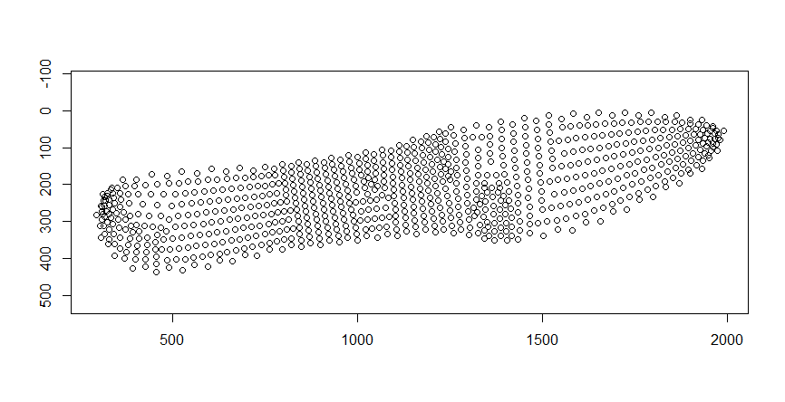

Plotting only the perimeter points
```r
plot(specimen.sampling.template, style = "perimeter")
```
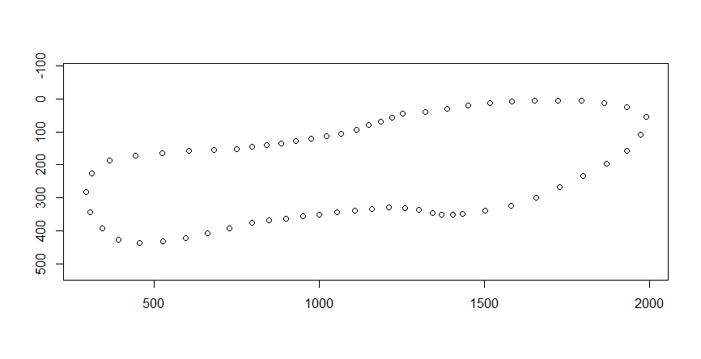

Plotting only the interior points
```r
plot(specimen.sampling.template, style = "interior")
```
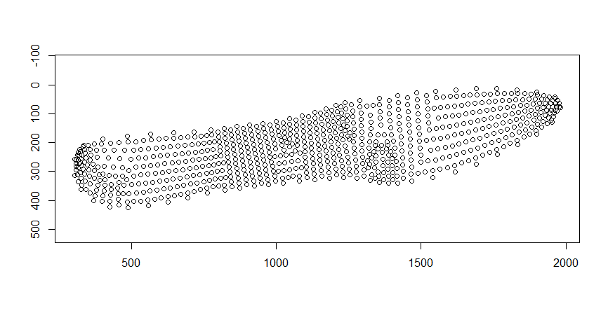

Plotting the map of the Delaunay trinagulation and the centroids of the triangles
```r
plot(specimen.sampling.template, style = "triangulation", wireframe.color = "black", point.color = "red")
```
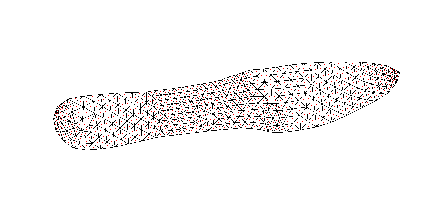


_Overlay on image_
The "triangulation" style can be plotted overlaying the test.image (defined above). The following code shows how to make this plot. The default colors for both the "triangulation" and "overlay" styles draw the triangles in black and the sampling points (centroids) in red. However, The user can change the color of the triangles and centroids using the point.color =   and wireframe.color =  arguments.
```r
plot(specimen.sampling.template, corresponding.image = align.test1, style = "overlay", wireframe.color = "grey", point.color = "yellow" )
```


## 2. Setting the sampling circle size and measuring RGB

The *rgb.measure* function measures the RGB values of the points sampled from the unwarped specimen images (at the points identified above in the *tri.surf* function). To control the size of the sampling circle, the user provides the radius length (in pixels) out from the centroid, from which to sample the surrounding pixels. In this function, the user first provides the file path to the folder containing the unwarped (to the consensus shape) images that are to be sampled, followed unwarped image names, next is the "specimen.sampling.template" (which provides sampling coordinates), an integer for the user-specified size of the sampling circle **radius** in pixels (px.radius = 0 will only sample the pixel located at the centroid of the triangle), and the logical argument for whether you would like to apply the linear transform (based on international standard IEC 61966-2-1:1999),to convert sRGB values to linearized values. 

```r
## The example code below uses the unwarped image names generated by the tps.unwarp function
uncalib_RGB <- rgb.measure(imagedir = "C:/Users/jennv/Desktop/Colormesh_test_jpg/unwarped_images_jpg/", image.names =  unwarped.jpg$unwarped.names, delaunay.map = specimen.sampling.template, px.radius = 2, linearize.color.space = FALSE)

## If unwarped images were generated externally, the image names will come from the 2nd column of the csv file
uncalib_RGB <- rgb.measure(imagedir = "C:/Users/jennv/Desktop/Colormesh_test_jpg/unwarped_images_jpg/", image.names = specimen.factors[,2], delaunay.map = specimen.sampling.template, px.radius = 2, linearize.color.space = FALSE)


linear_uncalib_RGB <- rgb.measure("C:/Users/jennv/Desktop/Colormesh_Test_2/unwarped_images/", image.names =  unwarped.jpg$unwarped.names, specimen.sampling.template, px.radius = 2, linearize.color.space = TRUE)

linear_uncalib_RGB <- rgb.measure("C:/Users/jennv/Desktop/Colormesh_Test_2/unwarped_images/", image.names = specimen.factors[,2], specimen.sampling.template, px.radius = 2, linearize.color.space = TRUE)
```

## Visualizing the sampled color

The example code below will plot the color sampled using the *rgb.measure* function. The "individual = " argument allows you to plot a specific specimen. The default of style = "points" which plots the color values that were sampled from the image (perimeter and interior). Similar to the plotting options above, you have the option of only plotting the perimeter or the interior points.  To compare your plotted sampled color values to the original image the color values were sampled from, set style = "comparison". Note that a plot of sampled values where linearize.color.space = TRUE will be darker than the original image due to the application of the linear transform.

Plotting measured color at all points
```r
plot(uncalib_RGB, individual = 8, style = "points")
```
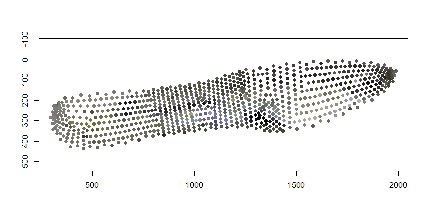

Plotting measured color at only the perimeter points
```r
plot(uncalib_RGB, individual = 8, style = "perimeter")
```
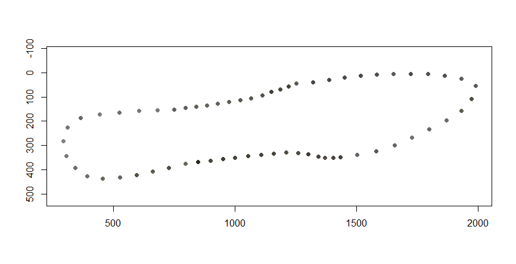

Plotting measured color at only the interior points
```r
plot(uncalib_RGB, individual = 8, style = "interior")
```
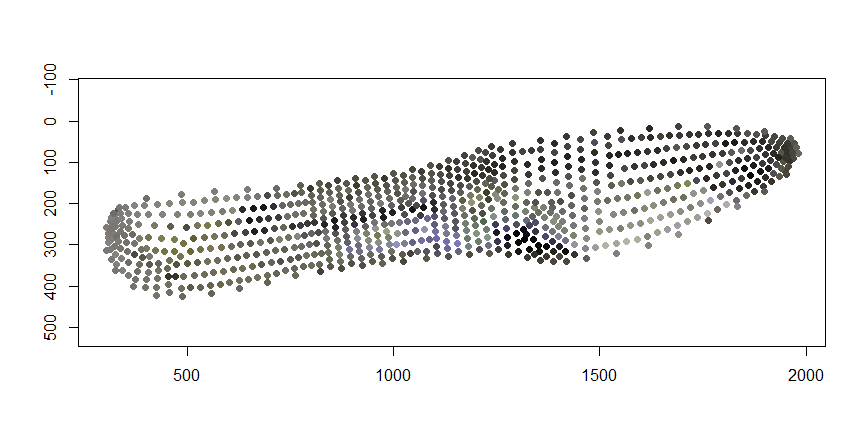

Plotting measured color at all points along with the image the color was sampled from 
```r
plot(uncalib_RGB, individual = 8, style = "comparison")
```
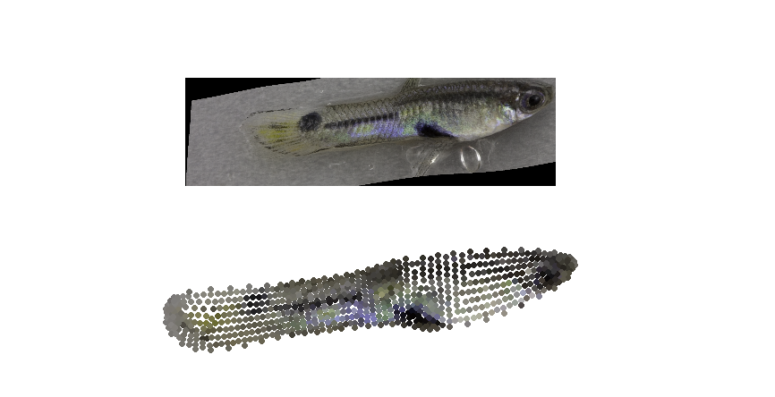

The plots hown above can be used to visualize your linearized color data as well.
*Note: Plotting the linearized measured color; these will appear darker*
```r
plot(linear_uncalib_RGB, individual = 8, style = "points")
plot(linear_uncalib_RGB, individual = 8, style = "perimeter")
plot(linear_uncalib_RGB, individual = 8, style = "interior")
plot(linear_uncalib_RGB, individual = 8, style = "comparison")
```
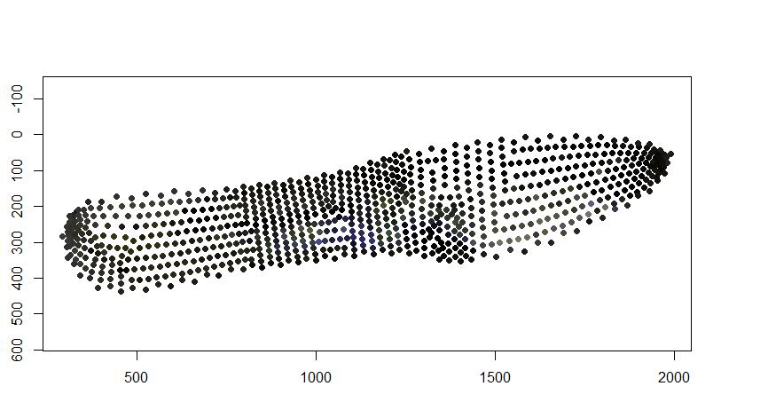 | 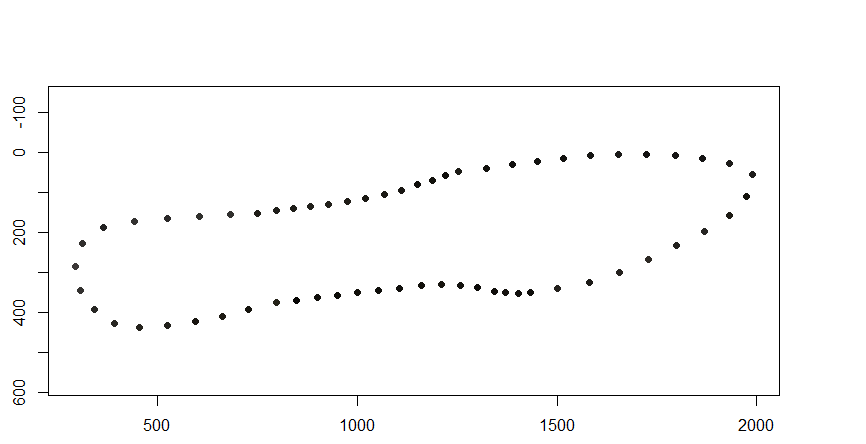 | 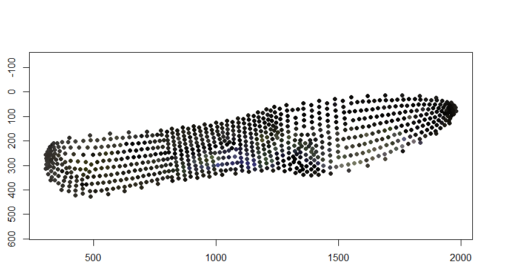 | 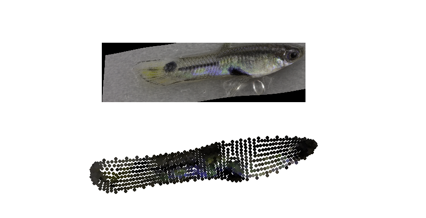


# Color calibration

Color information across images can be pretty noisy due to inconsistent lighting, different camera settings, movement of the object, etc. We highly recommend adjusting for those differences by including a color standard in each image. Using the differences in color standard values between images to mitigate variation due to noise, landmarks placed on the color standard are used to sample known RGB values and adjust the sampled color of your specimen by the average deviation in each color channel.  

The *rgb.calibrate* function goes through the calibration images and samples the color standards of each image. It then creates an array of these values. The default sampling circle radius is set to px.radius = 2. Once each color of the color standard is sampled, it determines the mean deviation in values of the R,G,B color channels from the known values of each color on the standardfor that image. The overal mean deviation in each color channel is used as a correction to the R,G, and B color values measured at each sampling point within a photo.

## Checking the alignment for sampling

Prior to calibrating each image, it is important to check that the sampling locations align with the color standard in the image. The code below plots colored dots at the locations where color will be sampled in the image. The user has the option to change the size and color of the dots that are plotted. This is a simple test to confirm the y-axis coordinates are correct. In the example below, yellow points are plotted over the locations that will be sampled for color calibration.
  
```r
calib.plot(imagedir = "C:/Users/jennv/Desktop/Colormesh_test_jpg/", image.names = specimen.factors[ ,1], calib.file = calib.LM.ext, individual = 3, col = "yellow", cex = 1)
```
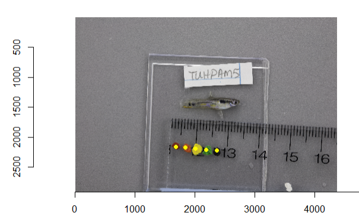


## Calibrating your measured color

The *rgb.calibrate* function will correct each image's measured RGB values based on the mean deviation of each color channel from the known RGB values of the color standard in that image. First, the user provides the name of the data that is to be calibrated, for example, "uncalib_RGB". Then the user provides the file path to the folder containing the original images (imagedir =). Next, "image.names = " is defined by providing the column containing the calibration image names from the csv containing this information. The coordinates of where to sample the color standard are defined as "calib.file = ". The logical argument for "flip.y.values" is available if the test image that is plotted shows that the y-coordinates need to be corrected (determined in the previous step with the calib.plot function). Finally, "color.standard.values = " is defined as the csv containing the known RGB values for the color standard. By default, the sampling circle that samples each color standard has a default radius = 2 pixels. You can change the size of the sampling circle with an integer when defining "px.radius = " as shown in the example code below.
*Note: If the calib.plot function showed proper alignment, set flip.y.values = F*
```r
calib_RGB <- rgb.calibrate(uncalib_RGB, imagedir =  "C:/Users/jennv/Desktop/Colormesh_test_jpg/", image.names = specimen.factors[ ,1], calib.file = calib.LM.ext, flip.y.values = F, color.standard.values = known.rgb)

##  By default, the radius of the sampling circle is = 2. The user can change the sampling circle size by providing a different integer. 
calib_RGB <- rgb.calibrate(uncalib_RGB, imagedir =  "C:/Users/jennv/Desktop/Colormesh_test_jpg/", image.names = specimen.factors[ ,1], calib.file = calib.LM.ext, flip.y.values = F, color.standard.values = known.rgb, px.radius = 3)
```
To calibrate measured RGB values where linearize.color.space = TRUE, the *rgb.calibrate function* is used in the same manner. The *rgb.calibrate* function detects that this data was linearized. When detected, both the known RGB values and the color measured from the color standard will be linearized prior to calculating the mean deviation from the known RGB values. This lienarized color correction will then be applied to the linearized values collected from the specimen images.

```r
linear_calib_RGB <- rgb.calibrate(linear_uncalib_RGB, imagedir =  "C:/Users/jennv/Desktop/Colormesh_Test_2/calib_images/", image.names = specimen.factors[ ,1], calib.file = calib.array, flip.y.values = F, color.standard.values = known.rgb)
```


##Visualizing the calibrated color

To plot your calibrated colors, you have the same options as above. With style = "points" both perimeter and interior points where color has been calibrated will be plotted. To print just the perimeter, style = "perimeter". With style = "interior" only the interior calibrated color values will be plotted. To compare your calibrated points to the uncalibrated points, set style = "comparison". 

Plotting calibrated color values with style = "points"
```r
plot(calib_RGB, individual = 5, style = "points")
```
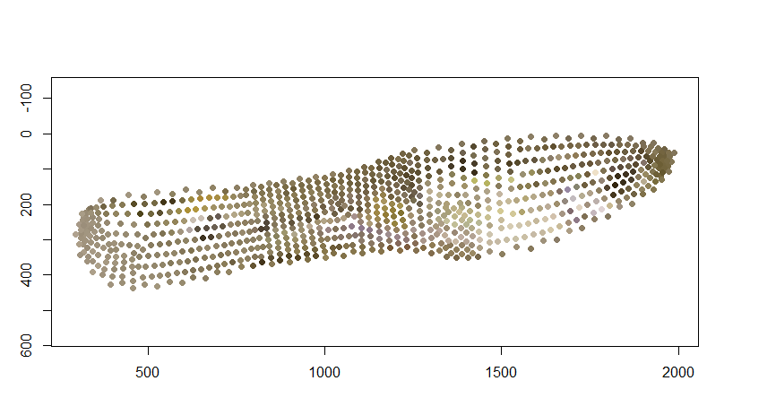

Plotting calibrated color values with style = "perimeter"
```r
plot(calib_RGB, individual = 5, style = "perimeter")
```
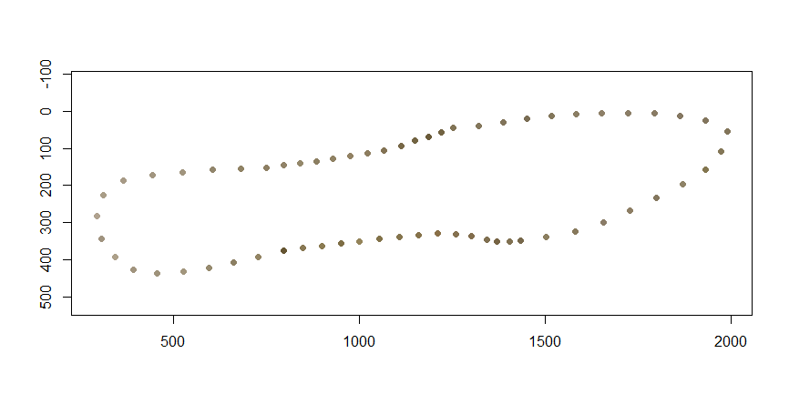

Plotting calibrated color values with style = "interior"
```r
plot(calib_RGB, individual = 5, style = "interior")
```
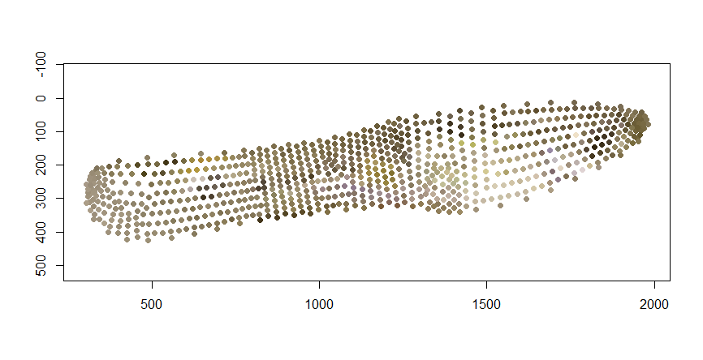

Plotting calibrated color values with style = "comparison"
```r
plot(calib_RGB, individual = 5, style = "comparison")
```
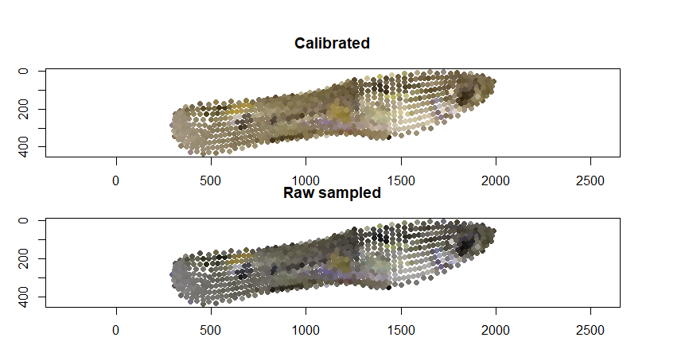


Linearized values can be plotted, as well. 
*Note: Linearized RGB values will have a darker appearance.* 

Plotting linearized calibrated color values with style = "points"
```r
plot(linear_calib_RGB, individual = 5, style = "points")
```
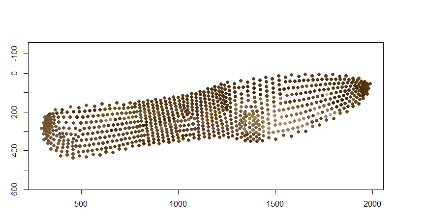

Plotting linearized calibrated color values with style = "perimeter"
```r
plot(linear_calib_RGB, individual = 5, style = "perimeter")
```
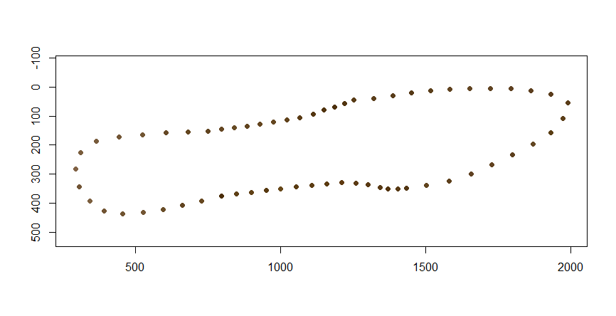

Plotting linearized calibrated color values with style = "interior"
```r
plot(linear_calib_RGB, individual = 5, style = "interior")
```
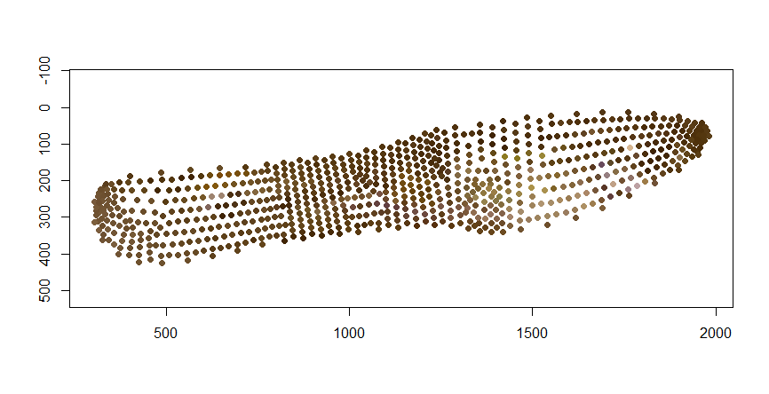

Plotting linearized calibrated color values with style = "comparison"
```r
plot(linear_calib_RGB, individual = 5, style = "comparison")
```
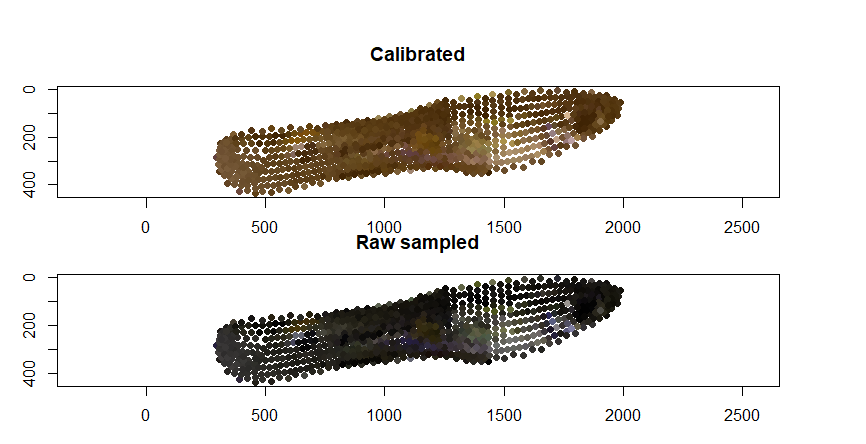


## Extracting your data

We created a simple function, *make.colormesh.dataset*, to compile your data into a single dataframe. The user specifies which dataset they would like to include, the csv containing the specimen information, and lastly, a logical argument (TRUE/FALSE) as to whether perimeter point data is included. 

This dataframe will give specimens in rows and RGB color values, following by point coordinates in columns. The column names indicate the point ID, whether it is an interior or perimeter point, and the color channel (R,G, or B). Following the columns of color data, the x,y coordinates of each point are also provided. In the guppy example shown here, there were 10 specimens and therefore 10 rows. Sampling points consisted of 62 perimeter points and 780 interior points for 842 total points sampled; each of these points has 3 color channels. The number of columns totals = 4214 (4 columns with specimen identification information, 842 * 3 = 2526 color columns, plus 842 * 2 = 1684 coordinate columns).

```r

## Need to update this
final.df.uncalib.tif <- make.colormesh.dataset(df = uncalib_RGB, specimen.factors = specimen.factors, use.perimeter.data = T)


final.df.uncalibrate <- make.colormesh.dataset(df = uncalib_RGB, specimen.factors = specimen.factors, use.perimeter.data = F)
final.df.uncalibrate.perim <- make.colormesh.dataset(df = uncalib_RGB, specimen.factors = specimen.factors, use.perimeter.data = T)

final.df.calibrate <- make.colormesh.dataset(df = calib_RGB, specimen.factors = specimen.factors, use.perimeter.data = F)
final.df.calibrate.perim <- make.colormesh.dataset(df = calib_RGB, specimen.factors = specimen.factors, use.perimeter.data = T)


final.df.uncalibrate.linear <- make.colormesh.dataset(df = linear_uncalib_RGB, specimen.factors = specimen.factors, use.perimeter.data = F)
final.df.uncalibrate.linear.perim <- make.colormesh.dataset(df = linear_uncalib_RGB, specimen.factors = specimen.factors, use.perimeter.data = T)

final.df.calibrate.linear <- make.colormesh.dataset(df = linear_calib_RGB, specimen.factors = specimen.factors, use.perimeter.data = F)
final.df.calibrate.linear.perim <- make.colormesh.dataset(df = linear_calib_RGB, specimen.factors = specimen.factors, use.perimeter.data = T)
```

If you would like to write this datafram to a .csv file, include the file path where you would like the file to be saved following the write2csv argument. 

```r
final.df.calibrate.saved <- make.colormesh.dataset(df = calib_RGB, specimen.factors = specimen.factors, use.perimeter.data = F, write2csv = "C:/Users/jennv/Desktop/Colormesh_Test_2/colormesh_data_calib.csv")

final.df.uncalibrate.saved <- make.colormesh.dataset(df = uncalib_RGB, specimen.factors = specimen.factors, use.perimeter.data = F, write2csv = "C:/Users/jennv/Desktop/Colormesh_Test_2/colormesh_data_uncalib.csv")
```

