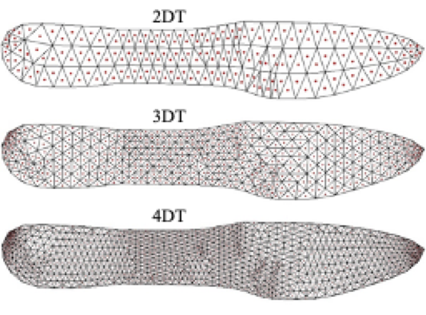
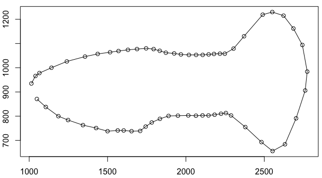
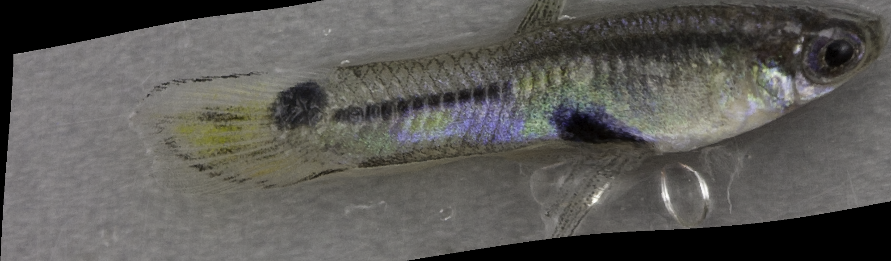
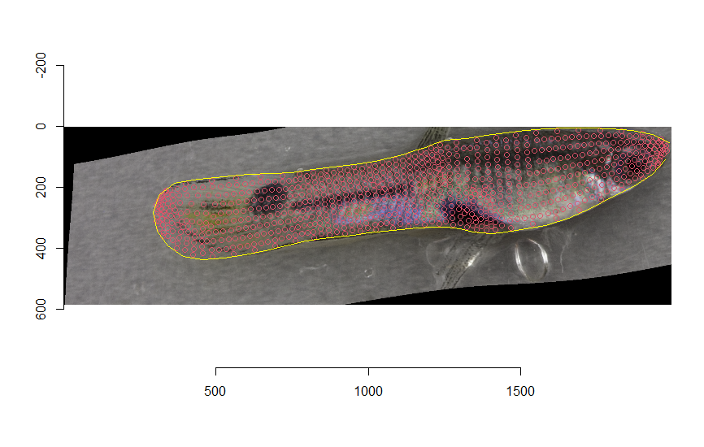
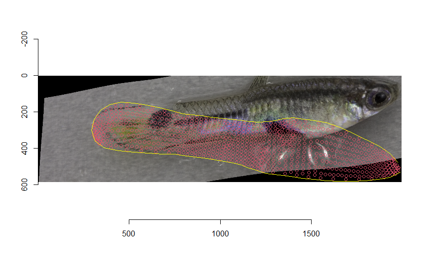
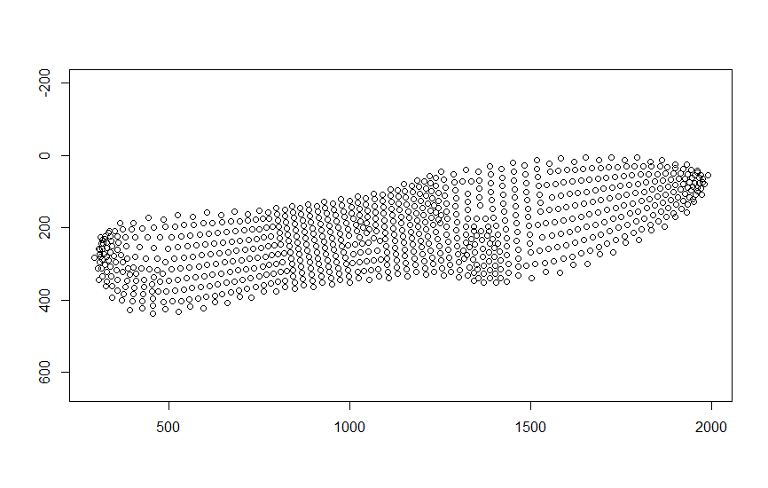
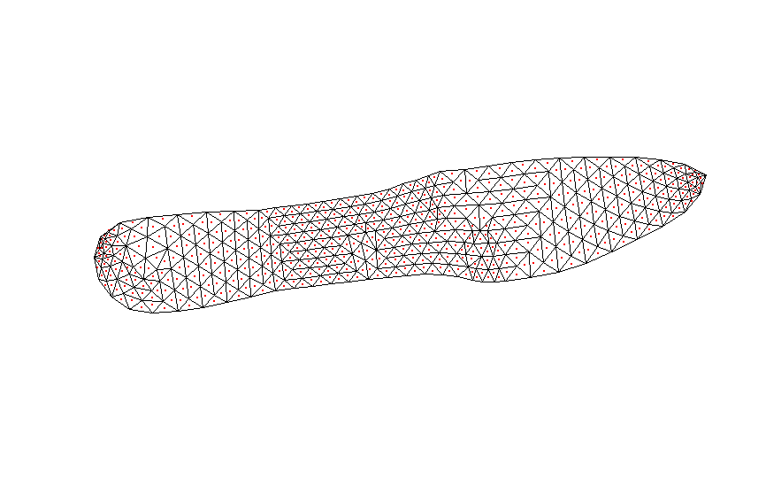
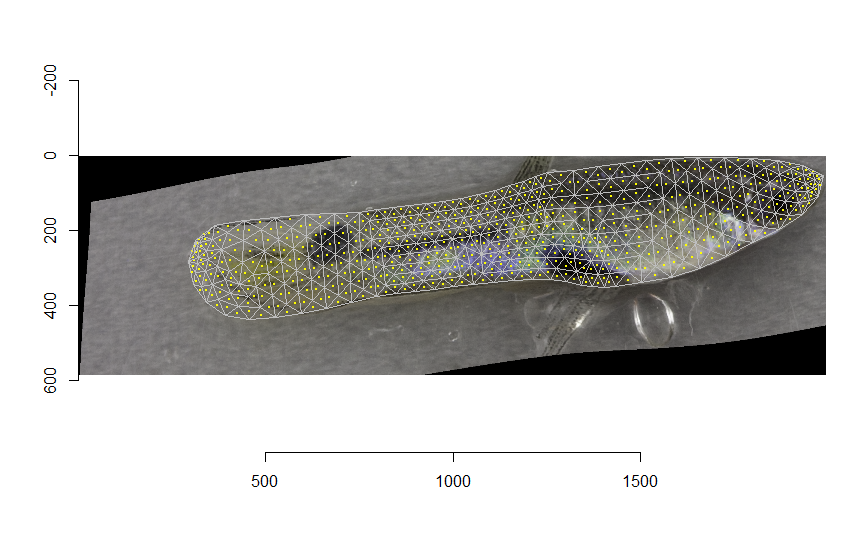

# Colormesh
An R package for extraction of color data from digital images.

## Installation

We strongly recommend you build the included vignette when installing the package. It provides a quick workflow with 10 images of guppies that originated from two populations to use as examples. Copy and paste the code below to install the package with the vignette:

```r
devtools::install_github("j0vid/Colormesh", build_vignettes = T)
```

The following command allows you to view the vignette:

```r
##################### I need to send you the images, csv file, and appropriate TPS files for you to include  ########################################
vignette("Guppy-images”)

```

### Using Colormesh (V1.0)

At this time, Colormesh requires that image processing using geometric morphometrics software take place prior to use. The guppy examples provided in the vignette were processed using the TPS Series software by James Rohlf, availble for free at the Stonybrook Morphometrics website (http://www.sbmorphometrics.org/). The TPS software was used for landmark placement and unwarping of images to a consensus shape. The rersulting files described below include TPS files, which contain landmark x,y coordinates, and the resulting unwarped images of each specimen to be sampled by Colormesh. 

### Required files for Colormesh (V1.0)
To prepare images for RGB color data sampling using Delaunay Triangulation, prepare the following folders and files:

  1. A .csv file containing factors that uniquely identify specimen images. This .csv file should omit the row names and column headers. This .csv file will be used as a check to ensure the calibration correction is applied to the appropriate image. The first column MUST be the image name of the original images (prior to unwarping to the consensus shape) used to place landmarks on the color standard; the names of these original images MUST be unique. The second column MUST contain the unique image name of the "unwarped" (to the consensus shape) version of the specimen image. This .csv file must contain at least these two columns and appear in the order described here. Any additional columns containing factors needed for your organization or identification (e.g., population name) can be included after these two columns.
  
  2. A .csv file containing the known RGB values of the colors on the color standard to be used for calibration. They should be on a scale of 0 to 1. Each column is a color on the standard, each row is a color channel; the know R, G, and B values must appear in rows 1, 2, and 3, respectively. If known RGB values are on a scale of 0-255, simply divide by 255 to convert values to the proper scale.
  
  3. A file folder containing: the original images that show the color standard AND the TPS file that was generated by placing landmarks on each of the colors of the standard. The image names must match the names that appear in the 1st column of the .csv (#1 above). 

  4. A file containing: the unwarped (to a consensus shape) images of each specimen AND the TPS file containing the coordinates of the landmarks for this consensus shape. The image names must match the name that appear in the 2nd column of the .csv file (#1 above). These images are produced by image processing in a geometric morphometrics program (ex. tpsSuper). Since all images were unwarped to this consensus shape, this TPS will only contain the number of coordinates equal to the number of landmarks placed around your specimen.


### Reading in .csv files
Code below loads in the two .csv files needed to use the Colormesh package to extract color data: 

 1. Using base R, read in the .csv containing the specimen image names and identification information. The first column MUST be 
    the unique image names of the original images that contain the color standard. The second column MUST contain 
    the unique image names of the images that were unwarped to the consensus shape. The remaining columns can 
    contain any other information you may need to identify your specimens.

 2. Using base R, read in the .csv containing the known RGB values for each of the colors on your color standard. The color channel 
    values should be on the scale of 0 to 1; if the are out of 255, simply divide by 255. The columns
    of this csv should be the different colors found on your color standard. Each row should provide the known
    color values the three (RGB) color channels. For example, if you have 5 colors in your color standard, you
    will have 5 columns. The first row of the csv should contain the known RED value for each of the five colors.
    The second row should contain the GREEN color channel values for each of the five colors on the standard. 
    The third row should have the BLUE color channel values for each of the five known colors on the standard. 


```r
specimen.factors = read.csv("C:/Users/jennv/Desktop/Colormesh_Test_2/specimen_factors.csv", header = F) 

known.rgb = read.csv("C:/Users/jennv/Desktop/Colormesh_Test_2/known_RGB.csv", header = F) 

```
### Reading in .TPS files

The function "tps2array" will read in the .TPS file which contains landmark coordinates and converts the information 
   into an array to be used in later functions.

```r

## The code below reads in the coordinates of the consensus specimen shape

consensus.array = tps2array(data= "C:/Users/jennv/Desktop/Colormesh_Test_2/consensus_LM_coords.TPS")


## The code below reads in the TPS file containing the coordinates for landmarks placed on the color
## standard contained withing the original images. 

calib.array = tps2array("C:/Users/jennv/Desktop/Colormesh_Test_2/calib_images/calib_LM_coords.TPS")

```


### Determining sampling density

Colormesh uses Delaunay triangulation to determine locations to samples color. The first round of Delaunay triangulation uses the landmark coordinates of the consensus shape as the vertices of the triangles. The function that creates this mesh was designed to provide the user with flexibility in sampling density based on the number of rounds of triangulation specified by the user; more rounds provides a greater density of sampling points. This is accomplished by using the centroids of the triangles created from the first round of Delaunay triangulation as the vertices for subsequent rounds of triangulation. 

Here's what an example of two, three, and four rounds of triangulation looks like:




### Generating and checking alignment of the sampling template

Colormesh needs to know what order to read the landmarks in so that a perimeter is drawn around the specimen in a "connect-the-dots" manner. The example code below defines a variable that gives the order in which to read in the x,y coordinates of the perimeter landmarks. In the guppy example below, the first seven landarks that were placed around the guppy were at traditional landmark locations (easily identifiable between images); the remaining 55 landmarks were interspersed between the traditional landmarks during the image processing. This perimeter map tells Colormesh the order in which to connect the points so a perimeter is drawn.

```{r}

perimeter.map <- c(1, 8:17, 2, 18:19, 3, 20:27, 4, 28:42,5,43:52, 6, 53:54, 7, 55:62)

```




# Calculating sample location and checking alignment 

IMPORTANT: Test that your sampling points properly overlay your image. Image readers (e.g., EBImage & imager) place the 0,0 x,y-coordinate in the upper left corner. In contrast, the coordinates in the TPS file place 0,0 in the bottom left corner. Colormesh assumes this to be true. To check this, the code below is used to read in a test image, calculate the sampling template, then plot the Delaunay triangulation wire-frame on top of the image to ensure that you are properly sampling the image. 

The density of sampling points is determined by Colormesh's *tri.surf* function and is defined by the user. This function identifies the X,Y coordinates of the centroid for each triangle generated by Delaunay triangulation. If more than one round of triangulation is specified by the user, these centroids function as vertices for subsequent rounds of triangulation. At the completion of the user-specified rounds of triangulation, the pixel coordinate for each triangle's centroid is saved as sampling coordinates. 

# Reading in a test image

To check that Colormesh will be sampling your speciment correctly, first read in one of the unwarped images from your image file.

```{r}
test.image = load.image("C:/Users/jennv/Desktop/Colormesh_Test_2/unwarped_images/TULPAAM03_1015_un.TIF")
```


# Generating the sampling template

The user provides the consensus.array (the x,y coordinates, defined above), perimeter.map (the order in which to read the points, defined above), a numerical value for the number of rounds of Delaunay triangulation to perform, the test.image (defined above), and the logical for flip.delaunay. The alignment check draws a yellow line around the perimeter of your speciment and red circles are plotted at the pixel coordinates that will be sampled.    
*Note: the circles shown in the alignment check are **not** equal to the size of the sampling circle size.*

```{r}
specimen.sampling.template = tri.surf(consensus.array, perimeter.map, 3, test.image, flip.delaunay = FALSE)

## If the sampling template is upside-down, set flip.delaunay = TRUE
specimen.sampling.template = tri.surf(consensus.array, perimeter.map, 3, test.image, flip.delaunay = TRUE)
```

The images below show the outcomes of the flip.delaunay logical argument.

 | 


### Setting the sampling circle size

The *rgb.measure* function measures the RGB values of the points sampled from the unwarped specimen images (at the points identified above in the *tri.surf* function). In this function, the user provides the file path to the folder containing the unwarped (to the consensus shape) images that are to be sampled, followed by the .csv containing the image names with the 2nd column specified (unwarped image names are in the second column), "specimen.sampling.template" (which provides sampling coordinates), the user-specified size of the sampling circle **radius** in pixels (px.radius = 0 will only sample the pixel located at the centroid of the triangle), and the logical argument for whether you would like to apply the linear transform (based on international standard IEC 61966-2-1:1999),to convert sRGB values to linearized values. 

```{r}
uncalib_RGB = rgb.measure("C:/Users/jennv/Desktop/Colormesh_Test_2/unwarped_images/", specimen.factors[,2], specimen.sampling.template, px.radius = 2, linearize.color.space = FALSE)

linear_uncalib_RGB = rgb.measure("C:/Users/jennv/Desktop/Colormesh_Test_2/unwarped_images/", specimen.factors[,2], specimen.sampling.template, px.radius = 2, linearize.color.space = TRUE)
```


### Color calibration

Color information across images can be pretty noisy due to inconsistent lighting, different camera settings, movement of the object, etc. We highly recommend adjusting for those differences by including a color standard in each image. Using the differences in color standard values between images to mitigate variation due to noise, landmarks placed on the color standard are used to sample known RGB values and adjust the sampled color of your specimen by the average deviation in each color channel. (see ```vignette("Calibrate-images")```). 

####################################### THIS WILL BE A NEW FUNCTION BY DAVID THAT WILL TAKE CARE OF THE UGLY R CODE #######################################
####################################### DAVID SEE COMMENTS BELOW
######### Above, the user already define the variables: known.RGB and calib.coords
######### THIS INCORPORATES A SAMPLING CIRCLE FUNCTION, SET DEFAULT TO 2 PIX, BUT HAVE OPTION FOR USER TO CHANGE THE SAMPLING CIRCLE RADIUS

```{r}

########################### NEW FUNCTION HERE #################################
########################### DAVID, CAN A CHECK BE PERFORMED HERE THAT THE DEVIATION MEASURED IN THE CALIBRATION IMAGE (COLUMN 1 of the factors.csv file) IS BEING APPLIED TO THE CORRECT VECTOR OF COLOR SAMPLED  FROM THE UNWARPED IMAGE (COLUMN 2 OF THE FACTORS.CSV)? 

corrected.color.sample = <what ever the new function is> (will need uncalibrated.color.sample, known.RGB, factors.csv?, calibration_sampling_circle_size)


################## The output should be a new matrix, same dimensions as the uncalibrated.color.sample matrix. However, it will have the correction applied. As a check, I compare these to make sure some adjustment has happened.


```
### Visualizing 

# Plotting the sampling template
The example code below shows how to plot the template where the specimen will be sampled. You may specify the style = "points" to plot the location of the points that will be sampled or style = "triangulation" to plot the triangulation that was generated and the centroids of each triangle. 

```{r}
plot(specimen.sampling.template, style = "points")
plot(specimen.sampling.template, style = "triangulation", wireframe.color = "black", point.color = "red")

```
 | 


The "triangulation" style can be plotted overlaying the test.image (defined above). The following code shows how to make this plot. The default colors for both the "triangulation" and "overlay" styles draw the triangles in black and the sampling points (centroids) in red. However, The user can change the color of the triangles and centroids using the point.color = "" and wireframe.color = ""  arguments.

```{r}
plot(specimen.sampling.template, corresponding.image = test.image, style = "overlay", wireframe.color = "grey", point.color = "yellow" )
```



###### DAVID, SHOULD PROBABLY Set something up for the bibtex so that if someone uses it, it will provide how to cite the package
