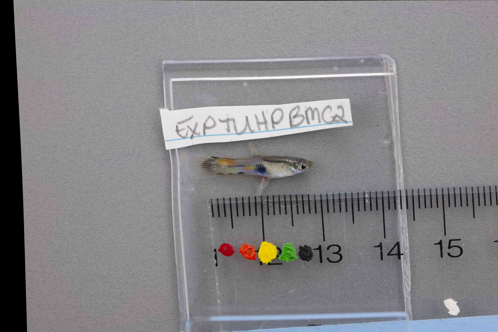
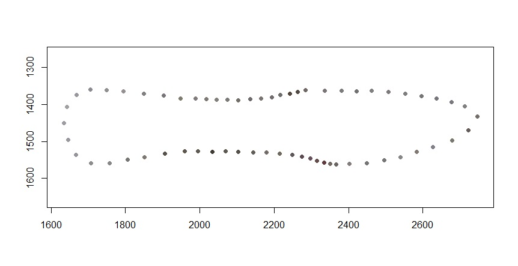

# __Colormesh (V2.0)__

An R package for generating consensus shaped specimen images and the extraction of color data from the consensus images.

# __1.  Installation__

*Colormesh* uses the *imager* package to read in images for some of the custom functions. If you are processing image formats other than PNG, JPEG, or BMP, you will need to install the program, ImageMagick on your computer: (https://imagemagick.org/script/download.php). Consistency is critical - image programs may behave differently from each other. Any image format conversions should be completed prior to using *Colormesh*. For example, if you convert raw image formats to a tif format, perform this conversion with the same software on all of your images (e.g., Prior to sampling images with *Colormesh*, use Photoshop to convert ALL of your images from .cr2 to .tif). If landmark placement and/or image transformation is/are performed externally (e.g., using *tpsDig* and/or *tpsSuper*), image format conversions need to be completed prior to placement of landmarks and/or image transformation using external programs. Sampling color using *Colormesh* has been tested successfully on several image formats where images were converted between formats using Photoshop.    

The following example code will guide you through the process of using *Colormesh* to extract color from images that have been transformed to a consensus shape. *Colormesh* offers the user the flexibility of completing all phases of image processing within its environment (see Section 2.2), importing landmark placement files generated externally (e.g., using *tpsDig*) and performing the image transformation within the *Colormesh* environment (see Section 2.2.1.2), or importing both landmark placement data and images that were transformed to a consensus shape using an external program (e.g., the *TPS Series* software, see Section 2.3). In Section 2, we provide details for the process of using *Colormesh*. This section is further divided into several subsections: Preparing CSV Files, Image Processing, Color Sampling Pipeline, and Calibration. These subsections provide details to guide the user through each possible approach to image processing which includes both landmark placement and image transformation (generation of consensus shape specimen images). This includes example code to show users how to complete the all image processing within the *Colormesh* environment, as well as importing files depending on the level of image processing completed externally. Because some users may already be familiar with existing geometric morphometric software, we have enabled *Colormesh* to import files typically generated by external processing (e.g., TPS files). 

Note: The external processing examples provided below are based on use of the *TPS Series* software by James Rohlf, available for free at the Stonybrook Morphometrics website (http://www.sbmorphometrics.org/). If you will be placing several landmarks (more than 10) around your specimens and this is the first time you have placed landmarks, we suggest the *tpsDig* software as a user-friendly interface with which to complete this task (link to a helpful "how to" video: https://youtu.be/r_1ZTVjRcf8); after placing landmarks with *tpsDig*, you would follow section 2.2.1.2, below.  


### Installing Colormesh from github
```r
devtools::install_github("https://github.com/J0vid/Colormesh")
```

# __2.  Using Colormesh (V2.0)__


## *Required files for Colormesh (V2.0) Color Sampling*

The files listed below are required to proceed with the Color Sampling Pipeline (Section 2.4). Some of the required files are obtained during image processing (i.e. landmark placement and image transformation). Image processing may be completed entirely within the *Colormesh* package. Alternatively, some or all of the image processing steps may be completed externally in your geometric morphometric program of choice, given the resulting landmark data are contained in a TPS file format. *Colormesh* will require the following files:

  * A .csv file where the first column contains the *UNIQUE* specimen image name. Image names must *not* contain symbols (e.g., +, %, -), puncuation, or spaces (however, underscores are acceptable). If image transformation (also known as unwarping) to the consensus shape was completed externally, you will need to provide the *UNIQUE* transfomred image names in the the second column so the original and transformed image names appear in the same row of the .csv file. If the images that will be sampled during the calibration process (described in Secion 2.5.2) are not the original specimen images, create a third column containing the *unique* image names for these calibration images; although the images sampled for calibration will typically be the original specimen images (where the names are provided in column one), calibration and original specimen images may differ, for example, if the original image was cropped into two separate images: one having the specimen and the other having the color standard. This .csv file will be used to ensure the measured color and calibration correction (if performed) are associated with the appropriate image. 
  
  * A .csv file containing the known RGB values of the colors on the color standard to be used for calibration. They should be on a scale of 0 to 1. Each row is a color on the standard, each column is a color channel; the known R, G, and B values must appear in columns 1, 2, and 3, respectively. If known RGB values are on a scale of 0-255, simply divide by 255 to convert values to the proper scale.

  * Two landmark coordinate data arrays: one having coordinate data for landmarks placed on the color standard and the other having landmark coordinate data for the consensus shape of the specimens. If landmark placement and/or specimen image transformation is/are performed within *Colormesh*, these arrays will be generated when using the functions described below (Sections 2.2.1 & 2.2.2 for landmark placement and image transformation, respectively). If these landmark data files are generated externally, they're typically in the form of TPS files. These TPS files are easily imported into *Colormesh* using a function that converts them into the appropriate array format (see Section 2.2.1.2). 
 
  * Create two image file folders: One file folder to hold the original specimen images and the second will store the transformed (unwarped) images. If you transform (unwarp) images within *Colormesh*, you will identify this folder as the location where unwarped images will be stored. If you generated transformed images externally, simply populate this "unwarped" file folder with the transformed images. If the images that will be sampled during the calibration process (Section 2.5.2) are not the original specimen images, provide a third file folder containing the calibration images. Although creation of file folders is not essential to the dfunctioning of *Colormesh*, following this guidline will help you stay organized! 
   

## 2.1  Preparing the required CSV Files

  * Using base R, read in the .csv containing the original specimen image names. The first column MUST contain *unique* image names (no punctuation, however, underscores may be used). If you have processed images externally, provide the *unique* transformed image names in the second column so they are in the same row as their corresponding original specimen image. If the images that will be used for calibration are not the original specimen images, provide the *unique* calibration image names in the third column of this .csv file. See details under: *Required files for Colormesh (V2.0) Color Sampling* provided above. 

  * Using base R, read in the .csv containing the known RGB values for each of the colors on your color standard. The color channel values should be on the scale of 0 to 1; if the are out of 255, simply divide by 255. The rows of this csv should equal the number of colors sampled from the color standard. Each column should provide the known color RGB values for each of the colors on the standard. For example, if you have 5 colors on the color standard, you will have 5 rows. The first column of the csv should contain the known RED color channel values for each of the five colors, the second column should contain the known GREEN color channel values, and the third column should have the known BLUE color channel values. 

```r
specimen.factors <- read.csv("C:/Users/jennv/Desktop/Colormesh_test_jpg/specimen_factors.csv", header = T)

known.rgb <- read.csv("C:/Users/jennv/Desktop/Colormesh_test_jpg/known_RGB.csv", header = T)  
```


## 2.2  Image Processing: Landmark placement & generating consensus shaped images

### 2.2.1  Landmark placement

Landmark placement may be performed either within the *Colormesh* environment (Section 2.2.1.1, below) or externally (Section 2.2.1.2, below). The aim of landmarks placement is to generate the two arrays that will be used by the *Colormesh* pipeline. Landmarks placed within the *Colormesh* environment (Section 2.2.1.1) will automatically generate the appropriately formatted arrays. Alternatively, landmarks placed using other software that are in the TPS file format can simply be imported, as described in Section 2.2.1.2, below.

#### 2.2.1.1 Landmark Placement within the *Colormesh* environment

*Colormesh* calls on the image digitization ability found in the *geomorph* package to create the required landmark data array. The *landmark.images* function behaves similarly to  the *digitize2d* function within the *geomorph* package; it will temporarily convert images to jpgs solely for obtaining landmark coordinates. A plot window will open with the first image. If the user defined a scale (e.g., scale = 10), the user will be prompted to first set the scale; if no scale was defined, the user will begin placing landmarks. In the example code below, the scale = 10. To set the scale, the user will create a line segment that expands across 10mm of the scale. To draw the line segment, the user first aligns the cross-hairs on the scale to where the first of two points will be placed. Click the left mouse button to place the first point of the line segment to be drawn. To place the second point, the user aligns the cross-hairs on the scale at the distance defined in the function and clicks to place this point, drawing a line segment. The user will be prompted as to whether they would like to keep the scale - to redraw the line segment, type "n". To keep the segment, type "y". The user will now begin placing the landmarks around the specimen. Follow the prompts in the R console. After placement of each landmark, the user will be prompted as to whether they would like to keep the landmark - "y" will advance to the next landmark, "n" will allow the user to place that landmark again (the "old" landmark will appear on the specimen, however, the recorded coordinates of the old landmark are replaced with the new coordinates). IMPORTANT: Be sure you have entered a "y" before proceeding to the next landmark - omission of a landmark will require you to start over with ALL landmark placement. After placing the number of landmarks defined in the function (nlandmarks = ), the user is prompted to advance to the next specimen. Upon completion of landmark placement on all specimens, a TPS file will be written to the directory specified in the function and the array of coordinates will be stored in the R environment. 

```r
## The landmark.images function initiates the landmarking process. In this example, 62 landmarks are placed: 7 traditional landmarks and 55 semilandmarks. 
specimen.LM <- landmark.images(imagedir = "C:/Users/jennv/Desktop/Colormesh_test_jpg/", image.names = specimen.factors[,1], nlandmarks = 62, scale = 10, writedir = "C:/Users/jennv/Desktop/Colormesh_test_jpg/", tps.filename = "specimen_LM.TPS")

## A new array is defined containing the coordinates of the landmarks placed on the color standard in each image. These coordinates identify where on the standard to sample the known color values that will be used during the calibration process.
calib.LM <- landmark.images(imagedir = "C:/Users/jennv/Desktop/Colormesh_test_jpg/", image.names = specimen.factors[,1], nlandmarks = 5, writedir = "C:/Users/jennv/Desktop/Colormesh_test_jpg/", tps.filename = "calib_LM.TPS")

```

#### 2.2.1.2 External landmark placement imported into the *Colormesh* environment
     
Landmarks can be placed using your geometric morphometric software of choice that generates a TPS file. Two TPS files will need to be created and imported: one having the coordinate data for landmarks placed around each specimen and another TPS file where landmarks were placed on the color standard. The function *tps2array* will read in the .TPS file containing landmark coordinate data and convert the information into the required array format.   

```r
## For clarity, we added .ext in the example code below to identify these data as coordinates that were imported into the Colormesh environment.  
specimen.LM.ext <-  tps2array("C:/Users/jennv/Desktop/Colormesh_test_jpg/orig_LM_jpg.TPS")

## The code below reads in the TPS file containing the coordinates for landmarks placed on the color standard contained within each specimen image. 
calib.LM.ext <-  tps2array("C:/Users/jennv/Desktop/Colormesh_test_jpg/calib_LM_jpg.TPS")
```


### 2.2.2  Transforming images to a consensus shape within *Colormesh*

Similar to landmark placement, images can be transformed (unwarped) to a consensus shape either within the *Colormesh* environment (described here) or in your favorite geometric morphometrics software then imported for sampling (Section 2.3, below). Here, we describe the process to generate two of the required files needed as input for the *Colormesh* sampling pipeline: the array of landmark coordinates of the consensus shape and the set of images where specimens have been unwarped to a consensus shape.

The original specimen images that are unwarped to a consensus shape within the *Colormesh* environment must be of the same pixel dimensions (height x width). For example, our images are 4368 pixels x 2912 pixels. Unwarping to a consensus shape within *Colormesh* is performed by the *tps.unwarp* function. The function first performs a Generalized Procrustes Analysis by employing the utilities of the *geomorph* package. Then, the *imager* package is used to perform a thin-plate spline (TPS) image transformation. Finally, the resulting unwarped images are saved as PNG image format files in the directory specified by the user. 
 

#### 2.2.2.1  Define perimeter map and sliding landmarks (if any) 
     
The first step is to define the perimeter map of the specimen and identifying which landmarks, if any, are sliding landmarks (semilandmarks). This perimeter map tells *Colormesh* what order to read the landmarks so that a perimeter is drawn around the specimen in a "connect-the-dots" manner. This perimeter map is used in both the unwarping process for sliding landmarks and the Delaunay triangulation calculation which determines sampling locations. In the guppy example below, the first seven landmarks that were placed around the guppy are the "traditional landmarks" (placed at locations that are easily identifiable among images); the remaining 55 landmarks are referred to as semilandmarks. Semilandmarks are interspersed between the traditional landmarks and allowed to slide along the tangent of the curve they create when generating a consensus shape. The *make.sliders* function identifies which landmarks are "traditional landmarks", and therefore will not slide in the calculation.

```r
## Define perimeter map (order the points occur around the perimeter)
perimeter.map <- c(1, 8:17, 2, 18:19, 3, 20:27, 4, 28:42,5,43:52, 6, 53:54, 7, 55:62)

## Define sliders (main.lms = identifies which of all 62 landmarks are the traditional landmarks and therefore will NOT slide)
sliders <- make.sliders(perimeter.map, main.lms = 1:7)
```


#### 2.2.2.2  Calculating the consensus shape
        
The second step is to calculate the consensus shape of the specimens. Prior to running the *tps.unwarp* function, you will need to create a file folder as a destination path for the function to write the unwarped images. The information required by the function includes: the directory containing the original specimen images that are to be unwarped to the consensus shape that is identified by the "imagedir" argument (note: original specimen images must all have the same pixel dimensions). Also provided to the function are the landmark coordinate data array for the landmarks that were placed around each specimen. To associate the coordinate data with the appropriate images, you must identify the column of the csv file that contains the *unique* specimen image names (1st column). If you have defined landmarks that are semilandmarks (landmarks that are allowed to slide), they need to be identified. Finally, you must provide the directory where *Colormesh* will write the unwarped images. These unwarped images will be saved as PNG images, which is an uncompressed (lossless) image format.

```r
## The example code below defines the landmark coordinate array generated in Section 2.2.1.1 (above)
unwarped.jpg <- tps.unwarp(imagedir = "C:/Users/jennv/Desktop/Colormesh_test_jpg/", landmarks = specimen.LM, image.names = specimen.factors[,1], sliders = sliders , write.dir = "C:/Users/jennv/Desktop/Colormesh_test_jpg/unwarped_images_jpg/")


## The example code below defines the landmark coordinate array generated in Section 2.2.1.2 (above) (see landmarks = specimen.LM.ext)
unwarped.jpg <- tps.unwarp(imagedir = "C:/Users/jennv/Desktop/Colormesh_test_jpg/", landmarks = specimen.LM.ext, image.names = specimen.factors[,1], sliders = sliders , write.dir = "C:/Users/jennv/Desktop/Colormesh_test_jpg/unwarped_images_jpg/")
```

The output of the function is a list having two elements. The "$target" element of the list is the landmark coordinate data for the CONSENSUS SPECIMEN SHAPE generated by the function; this is one of the landmark coordinate data arrays required by the *Colormesh* pipeline. The names given to the unwarped images appear as the 2nd list element (image.names). The resulting unwarped images are written to the directory given by the user; these images will be sampled in the Color Sampling Pipeline (Section 2.4, below). When the unwarped image files are opened, specimens will now have the same shape. Note: Some black areas near the edges of the images are expected as they are part of the unwarping process.
     




## 2.3  Image Processing was performed externally - importing the required files  

If the entirety of image processing (landmark placement and unwarping to a consensus shape) are performed externally, *Colormesh* can import all of the required files for the Color Sampling Pipeline (Section 2.4). Below, we identify the required information for the *Colormesh* sampling pipeline. This includes: 

   * Defining the perimeter map to be used when performing the Delaunay triangulation to generate the sampling template. 
   * The specimen factors csv: the *unique* unwarped image names must appear in the 2nd column, original image names appear in the 1st column.
   * The csv having the known RGB values of the color standard.
   * The two required arrays containing landmark coordinate data: the coordinates of landmarks placed on the color standard and the other array will be the landmark coordinate data of the __CONSENSUS__ specimen shape. These are imported using the *tps2array* function described aboveSection 2.2.1.2).
   * The two required images sets residing in their own folders. One image set is the original images (showing the color standard) and the other image set is the unwarped images.  

```r
## Defining the perimeter map - this will be used in the Color Sampling pipeline. This is the order of the row of x,y coordinates that will connect the landmarks in a "connect-the-dots" manner
perimeter.map <- c(1,8:17,2, 18:19,3,20:27,4, 28:42,5,43:52,6,53:54,7,55:62)

## Example code for reading in the two CSV files 
## NOTE: First column = original image names, 2nd column = unwarped names
specimen.factors.ext <- read.csv("C:/Users/jennv/Desktop/Colormesh_test_jpg/specimen_factors_ext.csv", header = T) 
known.rgb <- read.csv("C:/Users/jennv/Desktop/Colormesh_test_jpg/known_RGB.csv", header = T) 

## Example code for converting TPS files to the appropriate array format
## NOTE: CONSENSUS SHAPE COORDINATES ONLY
consensus.LM.ext <- tps2array("C:/Users/jennv/Desktop/Colormesh_test_jpg/consensus_LM_coords.TPS") 
calib.LM.ext <- tps2array("C:/Users/jennv/Desktop/Colormesh_test_jpg/calib_LM_jpg.TPS")

## Create two image folders holding the two sets of images (the original images set for the calibration process and the unwarped image set for the Color Sampling pipeline). 
```


## 2.4  Color Sampling Pipeline

To proceed with color sampling, you should now have available to *Colormesh*: 
   * The two required CSV files (one having image names and other having the known RGB values of the color standard). 
   * The two landmark coordinate arrays: one having land mark coordinate data of the CONSENSUS SPECIMEN SHAPE and the other having the landmark coordinate data of where to sample the color standard for the calibration process.
   * Two sets of images located in their own directories: the set of images that were unwarped to the consensus shape and the original set of images containing the color standard. If your images that will be sampled during the calibration process are not the original specimen images, you will have a third image file containing the images to be sampled for calibration. 

In the Color Sampling Pipeline, there are two main processes: 1) defining the sampling template (i.e., sampling density) and 2) defining the sampling circle size and then measuring RGB values of each sampling circle. For each of the two processes, we have included seveal checks along the way. These include alignment checks to confirm the orientation of the image during the sampling process and overlapping of sampling circles. In addition, we provide several options for visualizing your plots under each of the sections outlined below.   

### 2.4.1  Calculating the sampling template (sampling density)

*Colormesh* uses Delaunay triangulation as an unsupervised method of determining locations to sample color from the consensus shaped specimen images. The first round of Delaunay triangulation uses the landmark coordinates of the consensus shape as the vertices of the triangles. It reads in the landmark coordinates of this consensus sahpe based on the order defined by the *perimeter.map* variable. The function that creates this mesh was designed to provide the user with flexibility in sampling density based on the number of rounds of triangulation specified by the user; more rounds of triangulation provide a greater density of sampling points.

Here's what an example of two, three, and four rounds of triangulation looks like:


#### 2.4.1.1  Generating the sampling template and checking alignment

The sampling template is generated by the *tri.surf* function and is an integer defined by the user. The *tri.surf* function calculates the X,Y coordinates of the centroid for each triangle generated by Delaunay triangulation; *Colormesh* calls on the *tripack* package to perform the Delaunay triangulation. If more than one round of triangulation is specified by the user, these centroids function as vertices for subsequent rounds of triangulation. At the completion of the user-specified rounds of triangulation, the pixel coordinate for each triangle's centroid is saved as sampling coordinates. The arguments defined in the function include: the array having the coordinates of the __consensus shape__, the perimeter map, a test image to check the alignment of the sampling template, and a logical argument to address whether to flip the y-coordinates (see example images below). By default, flip.delaunay = FALSE. Be sure your specimen.sampling.template is defined with the correct orientation (indicated by whether the triangulation overlay is properly aligned). The alignment check draws a yellow line around the perimeter of your specimen and red circles are plotted at the pixel coordinates that will be sampled (NOTE: circles are sized to be easily visible and do not represent the number of pixels that will be sampled). 

IMPORTANT: Test that your sampling points properly overlay your image. Image readers (e.g., EBImage & imager) place the origin (0,0) x,y-coordinate in the upper left corner. In contrast, the coordinates in the TPS file place (0,0) in the bottom left corner. *Colormesh* assumes this to be true, which is why it is important to perform a plot to check the orientation. The example code below demonstrates how to load a test image and plot the sampling template over the image to check alignment. 


```r
## Reading in a test image using the imager package
align.test1 <- load.image("C:/Users/jennv/Desktop/Colormesh_test_jpg/unwarped_images_jpg/IMG_7658_unwarped.png")

## In the examples below, num.passes = 3 means three rounds of Delaunay Triangulation will be performed.
## Below shows example code using the consensus shape array that was calculated by the tps.unwarp function where unwarping was done within the Colormesh environment(Section 2.2.2, above). When flip.delaunay = F, the template was not aligned correctly; the tri.surp function was re-ran with flip.delaunay = T to define the specimen.sampling.template with the correct orientation.
specimen.sampling.template <- tri.surf(tri.object = unwarped.jpg$target, point.map = perimeter.map, num.passes = 3, corresponding.image = align.test1, flip.delaunay = F)
specimen.sampling.template <- tri.surf(tri.object = unwarped.jpg$target, point.map = perimeter.map, num.passes = 3, corresponding.image = align.test1, flip.delaunay = T)

## Below shows the example code if you imported the consensus specimen shape from a TPS file and converted it to an array (Section 2.3 above).
specimen.sampling.template <- tri.surf(tri.object = consensus.LM.ext, point.map = perimeter.map, num.passes = 3, corresponding.image = align.test1, flip.delaunay = T)
```

The images below show the alignment plot with the two outcomes of the flip.delaunay logical argument.

__Note: Images shown below differ from the previous images in this example - the image size and fish are different. These photos were selected to more clearly show correct/incorrect alignment.__

When flip.delaunay = FALSE and misaligned


When flip.delaunay = TRUE and aligned correctly


#### 2.4.1.2  Visualizing the sampling template

We have included the ability to plot the sampling template generated by the *tri.surf* function. The example code below shows how to plot the template where the specimen will be sampled. You may specify the style = "points" to plot the location of the all the points (perimeter and interior) that will be sampled, style = "perimeter" will print only the perimeter points, style = "interior" will plot only interior points, and style = "triangulation" will plot the triangulation that was generated and the centroids of each triangle. For style = "triangulation" you may change the color of the triangles that were generated (wireframe.color = ), as well as the color of the centroid (point.color = ).

_No overlay on image_

Plotting a map of all points (both the perimeter and interior) that will be sampled

```r
plot(specimen.sampling.template, style = "points")
```


Plotting only the perimeter points
```r
plot(specimen.sampling.template, style = "perimeter")
```


Plotting only the interior points
```r
plot(specimen.sampling.template, style = "interior")
```


Plotting the map of the Delaunay trinagulation and the centroids of the triangles
```r
plot(specimen.sampling.template, style = "triangulation", wireframe.color = "black", point.color = "red")
```


_Overlay on image_

The "triangulation" style can be plotted overlaying the *align.test1* image (defined above). The following code shows how to make this plot. The default colors for both the "triangulation" and "overlay" styles draw the triangles in black and the sampling points (centroids) in red. However, The user can change the color of the triangles and centroids using the point.color =   and wireframe.color =  arguments.

__Note: The image used to show the "overlay" option differs from those used in the *tps.unwarp* example above. Here we used a cropped image, and different fish, to demonstrate this visualization option. __

```r
plot(specimen.sampling.template, corresponding.image = align.test1, style = "overlay", wireframe.color = "grey", point.color = "yellow" )

## NEED TO UPDATE IMAGE
```


### 2.4.2 Setting the sampling circle size and measuring RGB

#### 2.4.2.1  Checking for overlapping sampling circles

Because sampling circle size is controlled by the user, we offer a diagnostic tool with the function *point.overlap*. The example code below demonstrates the use of this function to determine whether sampling circles of a given pixel radius (px.radius = ) will overlap. For example, a sampling circle with px.radius = 2 will have a sampling circle diameter of 5 pixels; the radius is 2 pixels out from the centroid pixel defined by the sampling template. If the sampling template (defined in Section 2.4.1) is dense, this may result in the overlap of sampling circles depending on their size (i.e., some pixels may be sampled twice if the circles overlap). This function checks for overlap of sampling circles and produces a dataframe with the sampling point ID and the distance between the centroid pixels of those that overlap. This function also produces a plot showing sampling circles that overlap in red (Note: the circle sizes of the plot are not drawn to scale, rather large enough to visualize where the overlap occurs).

```r
## The sampling template (specimen.sampling.template2) shown below is the result of 4 Delaunay triangulations and therefore more dense. A pixel radius of 2 (px.radius = 2) results in some sampling circles that overlap (see diagnostic plot below). The point ID is supplied in a dataframe produced by the function.

overlap = point.overlap(delaunay.map = specimen.sampling.template2, px.radius = 2, style = "points")
```


#### 2.4.2.2  Measuring RGB values
The *rgb.measure* function measures the RGB values of the points sampled from the unwarped specimen images at the points identified above in the *tri.surf* function. To control the size of the sampling circle, the user provides the radius length (in pixels) out from the centroid, from which to sample the surrounding pixels. In this function, the user first provides the file path to the folder containing the unwarped (consensus-shaped) images that are to be sampled, followed by the unwarped image names. Also provided are the "specimen.sampling.template" which defines the sampling coordinates), an integer for the user-specified size of the sampling circle **radius** in pixels (px.radius = 0 will only sample the centroid pixel), and the logical argument for whether you would like to apply the linear transform to convert sRGB values to linearized values (the linear transform calculation is based on international standard IEC 61966-2-1:1999). 

```r
## The example code below uses the unwarped image names generated within Colormesh by the tps.unwarp function (Section 2.2.2, above)
## NOTE: We use the specimen.sampling.template defined by 3 rounds of Delaunay trinagulation below
uncalib_RGB <- rgb.measure(imagedir = "C:/Users/jennv/Desktop/Colormesh_test_jpg/unwarped_images_jpg/", image.names = unwarped.jpg$unwarped.names, delaunay.map = specimen.sampling.template, px.radius = 2, linearize.color.space = FALSE)

## If unwarped images were generated externally, the image names will come from the 2nd column of the csv file
uncalib_RGB <- rgb.measure(imagedir = "C:/Users/jennv/Desktop/Colormesh_test_jpg/unwarped_images_jpg/", image.names = specimen.factors[,2], delaunay.map = specimen.sampling.template, px.radius = 2, linearize.color.space = FALSE)


## If the color values of the image are in sRGB colorspace, the values can be linearized setting linearie.color.space = TRUE 
linear_uncalib_RGB <- rgb.measure(imagedir = "C:/Users/jennv/Desktop/Colormesh_test_jpg/unwarped_images_jpg/", image.names = unwarped.jpg$unwarped.names, delaunay.map = specimen.sampling.template, px.radius = 2, linearize.color.space = TRUE)
```

#### 2.4.2.3 Visualizing the sampled color

The example code below will plot the color sampled using the *rgb.measure* function. The "individual = " argument allows you to plot a specific specimen. The default of style = "points" which plots the color values that were sampled from the image (perimeter and interior). Similar to the plotting options above, you have the option of only plotting the perimeter or the interior points.  To compare your plotted sampled color values to the original image the color values were sampled from, set style = "comparison". Note that a plot of sampled values where linearize.color.space = TRUE will be darker than the original image due to the application of the linear transform.

Plotting measured color at all points
```r
plot(uncalib_RGB, individual = 8, style = "points")
```


Plotting measured color at only the perimeter points
```r
plot(uncalib_RGB, individual = 8, style = "perimeter")
```


Plotting measured color at only the interior points
```r
plot(uncalib_RGB, individual = 8, style = "interior")
```


Plotting measured color at all points along with the image the color was sampled from 
```r
plot(uncalib_RGB, individual = 8, style = "comparison")
```


The plots shown above can be used to visualize your linearized color data as well. We show the "points" plot below.
*Note: Plotting the linearized measured color; these will appear darker*
```r
plot(linear_uncalib_RGB, individual = 8, style = "points")
```


## 2.5  Color calibration

Color information across images can be pretty noisy due to inconsistent lighting, different camera settings, movement of the object, etc. We highly recommend adjusting for those differences by including a color standard in each image. Using the differences in color standard values between images to mitigate variation due to noise, landmarks placed on the color standard are used to sample the known RGB values of the standard and adjust the sampled color of your specimen by the average deviation in each color channel.  

*Colormesh* uses the coordinates of landmarks placed on the standard in each image to sample known color values. Prior to calibration, it is important to check the alignment of the sampling coordinates and the images. Once you have determined whether an alignment correction must be made, an argument in the *rgb.calibrate* function can then be used to correct each image's measured RGB values. The function samples the color standards of each image at the coordinates supplied by the calibration array. An image-specific color correction vector is calculated based on the mean deviation of each color channel from the known RGB values of the color standard in that image. The correction vector is then applied to the measured RGB values of each image. 


### 2.5.1  Checking the alignment for sampling

Prior to calibrating each image, it is important to check that the sampling locations align with the color standard in the image. The code below plots colored dots at the locations where color will be sampled in the image. The user has the option to change the size and color of the dots that are plotted. This is a simple test to confirm the y-axis coordinates are correct. In the example below, yellow points are plotted over the locations that will be sampled for color calibration. By default, the logical argument for flip.y.values = F; if your points appear at the top of your image (bottom image), set flip.y.values = T. The images below demonstrate what to expect for the F/T argument. The calib.plot function enables the user to determine what this parameter should be set to in the rgb.calibrate function (below). 
  
```r
## Plot a test image to check that the landmark coordinates are aligned correctly over the standard. We specified the point color and size to make them visible
calib.plot(imagedir = "C:/Users/jennv/Desktop/Colormesh_test_jpg/", image.names = specimen.factors[ ,1], calib.file = calib.LM, individual = 3, col = "yellow", cex = 1, flip.y.values = F)
```


### 2.5.2  Calibrating the measured RGB values

For the *rgb.calibrate* function, the user first provides the name of the data that is to be calibrated, for example, "uncalib_RGB". Then the user provides the file path to the folder containing the original images (imagedir =). Next, "image.names = " is defined by providing the column containing the calibration image names from the csv containing this information. The coordinates of where to sample the color standard are defined as "calib.file = ". The logical argument for "flip.y.values" is available if the test image that is plotted shows that the y-coordinates need to be corrected (determined in the previous step with the calib.plot function). Finally, "color.standard.values = " is defined as the csv containing the known RGB values for the color standard. By default, the sampling circle that samples each color standard has a default radius = 2 pixels. You can change the size of the sampling circle with an integer when defining "px.radius = " as shown in the example code below. 
*Note: If the calib.plot function showed proper alignment, set flip.y.values = F*

```r
calib_RGB <- rgb.calibrate(uncalib_RGB, imagedir =  "C:/Users/jennv/Desktop/Colormesh_test_jpg/", image.names = specimen.factors[ ,1], calib.file = calib.LM.ext, flip.y.values = F, color.standard.values = known.rgb)

##  By default, the radius of the sampling circle is = 2. The user can change the sampling circle size by providing a different integer. 
calib_RGB <- rgb.calibrate(uncalib_RGB, imagedir =  "C:/Users/jennv/Desktop/Colormesh_test_jpg/", image.names = specimen.factors[ ,1], calib.file = calib.LM.ext, flip.y.values = F, color.standard.values = known.rgb, px.radius = 3)
```

To calibrate measured RGB values where linearize.color.space = TRUE, the *rgb.calibrate* function is used in the same manner. The *rgb.calibrate* function detects that this data was linearized  because the logical in the list produced from the *rgb.measure* function = TRUE. When detected, both the known RGB values and the color measured from the color standard will be linearized prior to calculating the mean deviation from the known RGB values. This linearized color correction will then be applied to the linearized values collected from the specimen images.

```r
linear_calib_RGB <- rgb.calibrate(linear_uncalib_RGB, imagedir =  "C:/Users/jennv/Desktop/Colormesh_test_jpg/", image.names = specimen.factors[ ,1], calib.file = calib.LM.ext, flip.y.values = F, color.standard.values = known.rgb)
```


### 2.5.3  Visualizing the calibrated color

To plot your calibrated colors, you have the same options as above. With style = "points" both perimeter and interior points where color has been calibrated will be plotted. To print just the perimeter, style = "perimeter". With style = "interior" only the interior calibrated color values will be plotted. The __exception__ is with the comparison plot. In the comparison plot, it compares the calibrated points to the uncalibrated points when style = "comparison". 


```r
## Plotting calibrated color values with style = "points"
plot(calib_RGB, individual = 5, style = "points")

## Plotting calibrated color values with style = "perimeter"
plot(calib_RGB, individual = 5, style = "perimeter")

## Plotting calibrated color values with style = "interior"
plot(calib_RGB, individual = 5, style = "interior")

## EXCEPTION: This plot compares uncalibrated and calibrated color values
##Plotting calibrated color values with style = "comparison"
plot(calib_RGB, individual = 5, style = "comparison")
```


Linearized values can be plotted, as well. 
*Note: Linearized RGB values will have a darker appearance.* 

```r
## Plotting linearized calibrated color values with style = "points"
plot(linear_calib_RGB, individual = 3, style = "points")

## Plotting linearized calibrated color values with style = "perimeter"
plot(linear_calib_RGB, individual = 3, style = "perimeter")

##Plotting linearized calibrated color values with style = "interior"
plot(linear_calib_RGB, individual = 3, style = "interior")

##Plotting linearized calibrated color values with style = "comparison"
plot(linear_calib_RGB, individual = 3, style = "comparison")
```


# __3. Extracting your data__

We created a simple function, *make.colormesh.dataset*, to compile your data into a single dataframe. The user specifies the dataset (e.g., calib_RGB) , the csv containing the image names, and the logical argument (TRUE/FALSE) for inclusion of perimeter point data. Note: Some users may decide to exclude perimeter points since they may sample background color depending on landmark placement and sample circle size. 

This dataframe that is generated will provide data for individual specimens in rows. Original specimen image names will appear in the 1st column. Subsequent columns identify the point sampled and the color channel. For example, column headers will appear as follows: r_interior27, g_interior27, and b_interior27 which indictes that the values appearing in each column are r,g,b values, respectively, associated with point #27. Whether the point is an interior or perimeter point is included in the column header. Following the columns of color data, we provide the X & Y coordinates of the center pixel of each sampling circle. For exmple, you will see x27 and y27 which are the x and y pixel coordinate values, respectively, for point #27.    

```r
## Saves to your R environment
final.df.uncalib <- make.colormesh.dataset(df = uncalib_RGB, specimen.factors = specimen.factors, use.perimeter.data = T)

## If you would like to write this datafram to a .csv file, include the file path where you would like the file to be saved following the write2csv argument. 
final.df.uncalib.saved <- make.colormesh.dataset(df = uncalib_RGB, specimen.factors = specimen.factors, use.perimeter.data = T, write2csv = "C:/Users/jennv/Desktop/Colormesh_test_jpg/colormesh_data_uncalib.csv")
```

